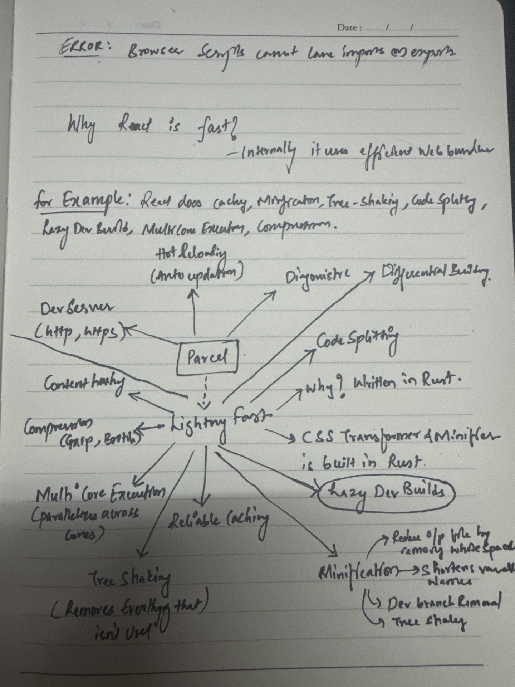

# React

## Dependencies Step by Step 

### 1. Parcel (Bundler, HMR etc...)

- Parcel does following actions. 

  <!-- First Column -->
  

    <blockquote>
      <ul>
        <li>Dev Build</li>
        <li>Local Server</li>
        <li>HMR - Hot Module Development // When we save in any file, it will automatically refresh in the browser.
          <ul>
            <li>Uses File Watching Algorithm which is implemented in C++</li>
          </ul>
        </li>
        <li>Also caches the things for us for faster builds.</li>
        <li>Does Image Optimization (Which is basically a costly operation while rendering web page i.e., image rendering is costly operation)</li>
        <li>Minification</li>
        <li>Bundles</li>
        <li>Compresses the code and ships.</li>
        <li>Consistent Hashing</li>
        <li>Code Splitting</li>
        <li>Differential Bundling</li>
        <li>Diagnostic</li>
        <li>Error Handling</li>
        <li>Can also provide a way to host on HTTPs with SSL certificates.</li>
        <li>Tree Shaking - remove unused code.</li>
      </ul>
    </blockquote>
  

  <!-- Second Column -->
  

    
  

